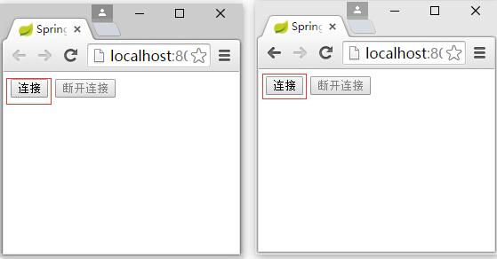
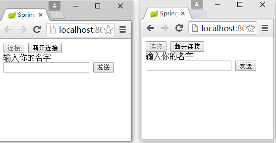
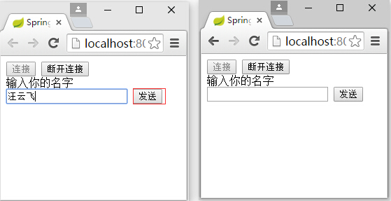
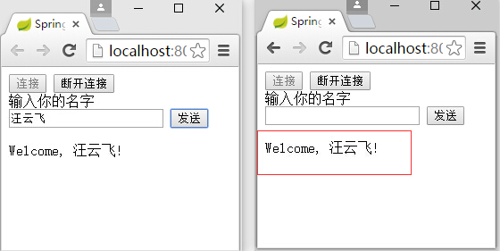
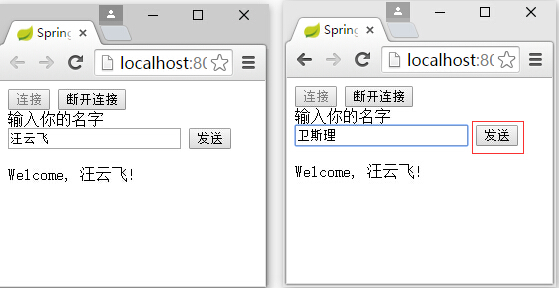
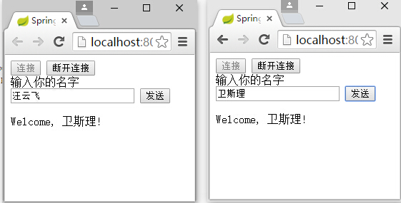

## 6.1 WebSocket
- `WebSocket`对服务器端和浏览器的双向通讯提供了支持;
- `WebSocket`一个基于TCP的轻量级协议;
- 可定义`WebSocket`子协议来传递数据
 - 本教程使用`STOMP`协议来演示

## 6.2 示例
### 6.2.1 websocket订阅广播式

- 此例基于[Using WebSocket to build an interactive web application](https://spring.io/guides/gs/messaging-stomp-websocket/)修改,修改了一些命名,更利于理解

- 添加spring boot开放websocket依赖

```
<dependency>
    <groupId>org.springframework.boot</groupId>
    <artifactId>spring-boot-starter-websocket</artifactId>
</dependency>
<dependency>
    <groupId>org.springframework</groupId>
    <artifactId>spring-messaging</artifactId>
</dependency>
```

- 添加页面端的脚本支持
 - 下载`sockjs.min.js`到`static`文件夹
 - 下载`stomp.min.js`到`static`文件夹

- 发送信息类

```
package com.wisely.demoboot.domain;

public class WiselyMessage {
    private String name;

    public String getName(){
        return name;
    }
}

```

- 返回信息类

```
package com.wisely.demoboot.domain;

public class WiselyResponse {
    private String responseMessage;
    public WiselyResponse(String responseMessage){
        this.responseMessage = responseMessage;
    }
    public String getResponseMessage(){
        return responseMessage;
    }
}

```

- `websocket`配置文件

```
package com.wisely.demoboot.config;

import org.springframework.context.annotation.Configuration;
import org.springframework.messaging.simp.config.MessageBrokerRegistry;
import org.springframework.web.socket.config.annotation.AbstractWebSocketMessageBrokerConfigurer;
import org.springframework.web.socket.config.annotation.EnableWebSocketMessageBroker;
import org.springframework.web.socket.config.annotation.StompEndpointRegistry;

/**
 * 配置开启对websocket和STOMP消息支持
 */
@Configuration
@EnableWebSocketMessageBroker //开启由消息拦截器支撑的websocket信息处理
public class WiselyWebSocketConfig extends AbstractWebSocketMessageBrokerConfigurer{

    @Override
    public void registerStompEndpoints(StompEndpointRegistry registry) {
        registry.addEndpoint("/endpoint").withSockJS(); //注册一个SockJS的endporint,因为页面使用的sockjs
    }


    @Override
    public void configureMessageBroker(MessageBrokerRegistry registry) {
        registry.enableSimpleBroker("/topic"); //开启一个内存消息拦截器
        registry.setApplicationDestinationPrefixes("/app");//页面发送信息的地址为/app/welcome
    }
}


```

- `websocket` 演示控制器

```
package com.wisely.demoboot;

import com.wisely.demoboot.domain.WiselyMessage;
import com.wisely.demoboot.domain.WiselyResponse;
import org.springframework.messaging.handler.annotation.MessageMapping;
import org.springframework.messaging.handler.annotation.SendTo;
import org.springframework.stereotype.Controller;
//Spring支持将STOMP信息路由到@Controller
@Controller
public class WsController {
    @MessageMapping("/welcome") //前台发送STOMP信息到/hello被say方法处理,类似于@RequestMapping
    @SendTo("/topic/getResponse") //返回信息广播到所有订阅了/topic/getResponse的浏览器页面
    public WiselyResponse say(WiselyMessage message) throws Exception {
        Thread.sleep(3000); // 模仿做过一些业务处理
        return new WiselyResponse("Welcome, " + message.getName() + "!");
    }
}


```

- 添加演示页面`ws.html`

```
<!DOCTYPE html>
<html xmlns:th="http://www.thymeleaf.org">
<head>
    <meta charset="UTF-8" />
    <title>Spring Boot+WebSocket示例</title>

</head>
<body onload="disconnect()">
<noscript><h2 style="color: #ff0000">貌似你的浏览器不支持websocket</h2></noscript>
<div>
    <div>
        <button id="connect" onclick="connect();">连接</button>
        <button id="disconnect" disabled="disabled" onclick="disconnect();">断开连接</button>
    </div>
    <div id="conversationDiv">
        <label>输入你的名字</label><input type="text" id="name" />
        <button id="sendName" onclick="sendName();">发送</button>
        <p id="response"></p>
    </div>
</div>
<script src="sockjs.min.js"></script>
<script src="stomp.min.js"></script>
<script src="jquery.js"></script>
<script type="text/javascript">
    var stompClient = null;

    function setConnected(connected) {
        document.getElementById('connect').disabled = connected;
        document.getElementById('disconnect').disabled = !connected;
        document.getElementById('conversationDiv').style.visibility = connected ? 'visible' : 'hidden';
        $('#response').html();
    }

    function connect() {
        var socket = new SockJS('/endpoint');
        stompClient = Stomp.over(socket);
        stompClient.connect({}, function(frame) {
            setConnected(true);
            console.log('Connected: ' + frame);
            //订阅/topic/getResponse
            stompClient.subscribe('/topic/getResponse', function(respnose){
                showResponse(JSON.parse(respnose.body).responseMessage);
            });
        });
    }

    function disconnect() {
        if (stompClient != null) {
            stompClient.disconnect();
        }
        setConnected(false);
        console.log("Disconnected");
    }

    function sendName() {
        var name = $('#name').val();
        //向控制器发送数据
        stompClient.send("/app/welcome", {}, JSON.stringify({ 'name': name }));
    }

    function showResponse(message) {
          var response = $("#response");
          response.html(message);
    }
</script>
</body>
</html>
```

- 注册该页面的viewController
 - 在`WiselyMvcConfig`的`addViewControllers`添加

 ```
 registry.addViewController("/ws").setViewName("ws");
 ```

- 运行测试,访问http://localhost:8080/ws
 

 

 

 

 

 