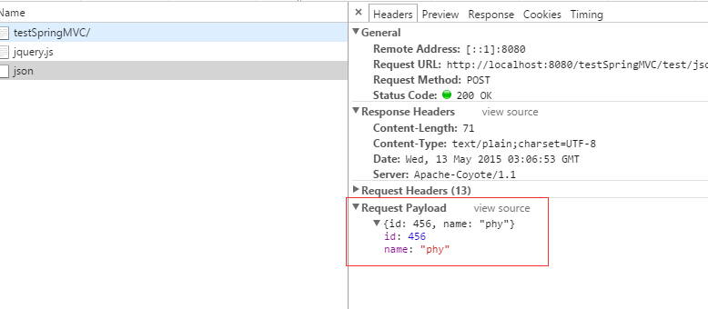

## 2.1 @RequestMapping
- **@RequestMapping**是SpringMVC的核心注解,负责访问的url与调用方法之间的映射;
- **@RequestMapping**可以放在类和方法上;
 - @RequestMapping的属性produces属性控制response返回的形式;
 - @RequestMapping的属性method属性控制接受访问的类型,不写不做限制,本例为演示方便全部都是get请求;
- **@ResponseBody**(放在方法上或者返回值类型前)将方法参数放置在web body的body中(返回的不是页面而是你所控制的字符)
- **@RequestBody**(放在方法参数前)将方法参数放置在web request的body中(如提交一个json对象作为参数)
- 这节使用**@RequestMapping**演示常用映射场景


## 2.2 演示
- 控制器 `TestController`

```
package com.wisely.web;

import javax.servlet.http.HttpServletRequest;

import org.springframework.stereotype.Controller;
import org.springframework.web.bind.annotation.PathVariable;
import org.springframework.web.bind.annotation.RequestMapping;
import org.springframework.web.bind.annotation.RequestParam;
import org.springframework.web.bind.annotation.ResponseBody;

@Controller //声明为控制器bean
@RequestMapping("/test")// 根地址为http://localhost:8080/testSpringMVC/test
public class TestController {
	@RequestMapping(produces = "text/plain;charset=UTF-8") //response类型为text/plain,编码是utf-8
    //映射地址为http://localhost:8080/testSpringMVC/test
	@ResponseBody //此注解让返回值不是页面,也是将结果字符串直接返回
	public  String root(HttpServletRequest request){
		return "url:"+request.getRequestURL()+" 可以访问此方法";
	}

	@RequestMapping(value = "/add",produces = "text/plain;charset=UTF-8")
    //映射地址为http://localhost:8080/testSpringMVC/test/add
	@ResponseBody
	public   String add(HttpServletRequest request){
		return "url:"+request.getRequestURL()+" 可以访问此方法";
	}

	@RequestMapping(value = {"/remove","/delete"},produces = "text/plain;charset=UTF-8")
    //映射地址为http://.../test/remove(或http://.../test/delete)
	@ResponseBody
	public   String remove(HttpServletRequest request){
		return "url:"+request.getRequestURL()+" 可以访问此方法";
	}

	//获取request参数
	//获取路径参数
	@RequestMapping(value = "/get",produces = "text/plain;charset=UTF-8")
    //映射路径http://.../test/get?id=123
	@ResponseBody
	public String passRequestParam(@RequestParam Long id,HttpServletRequest request){
		System.out.println("id为"+id);
		return "url:"+request.getRequestURL()+" 可以访问此方法";

	}


	//获取路径参数
	@RequestMapping(value = "/{id}",produces = "text/plain;charset=UTF-8")
    //映射路径http://.../test/123
	@ResponseBody
	public String passPathVariable(@PathVariable Long id,HttpServletRequest request){
		System.out.println("id为"+id);
		return "url:"+request.getRequestURL()+" 可以访问此方法";

	}

	//获得对象
	@RequestMapping(value = "/pass",produces = "text/plain;charset=UTF-8")//映射路径http://.../test/pass?id=123&name=wyf
	@ResponseBody
	public String passObj(DemoObj obj,HttpServletRequest request){
		System.out.println("对象的id和名称分别为为："+obj.getId()+"/"+obj.getName());
		return "url:"+request.getRequestURL()+" 可以访问此方法";

	}

	//从json中获得对象
	@RequestMapping(value = "/json",produces = "text/plain;charset=UTF-8")//映射路径http://.../test/json
	@ResponseBody
	public String passJson(@RequestBody DemoObj obj,HttpServletRequest request){
		System.out.println("对象的id和名称分别为为："+obj.getId()+"/"+obj.getName());
		return "url:"+request.getRequestURL()+" 可以访问此方法";

	}


}

```

- 从json中获取对象:此处有额外部分
  - 添加**jackson-databind**依赖,spring根据此包会自动将json字符串转换为对象接受
   ```
    <dependency>
        <groupId>com.fasterxml.jackson.core</groupId>
        <artifactId>jackson-databind</artifactId>
        <version>2.5.3</version>
    </dependency>
   ```
  - 对应页面代码
   ```
    var json = {"id":456,"name":"phy"};

    $.ajax({
      url: "test/json",
      data: JSON.stringify(json),
      type:"POST",
      contentType:"application/json",
      success: function(data){
          console.log(data)
      }
    });
   ```
 - 效果
 
 
